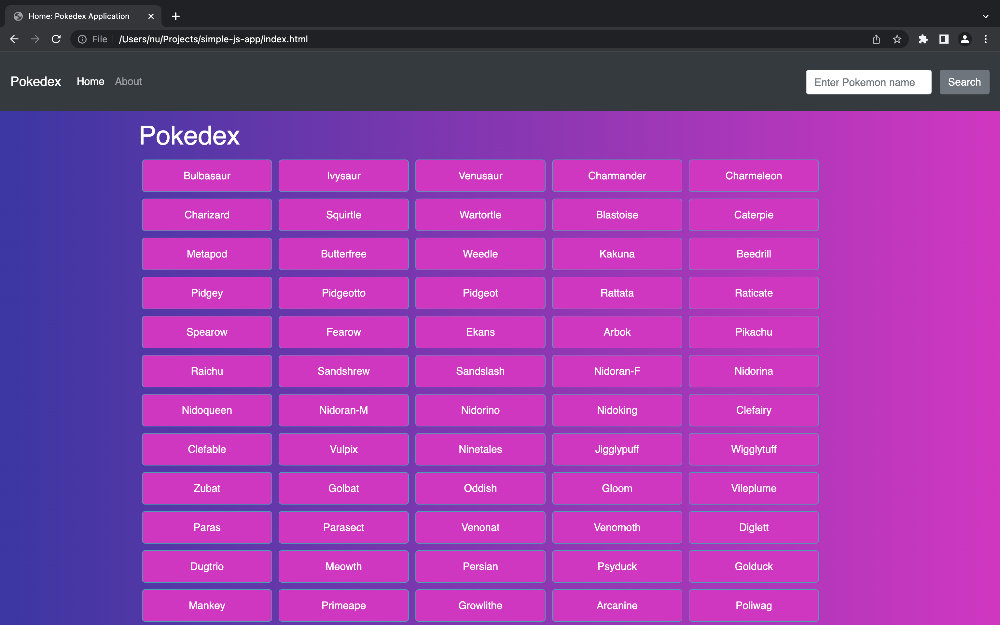

# Pokédex application

This Pokedex application is a small client side web application that loaded Pokemons details from an external RESTful Pokedex API. 

## Main Page

## Key Features 
  * Load Pokemons and their details (image, height and type) from an external Pokedex API.
  * Display loading image while Pokemons are being loaded. 
  * Display a list of Pokemon after the page is loaded.
  * On user action (e.g., by clicking on a Pokemon), display details for that particular Pokemon in modal.
  * Search a specific Pokemon on Pokedex API by name.

## Technologies
  * HTML 5
  * CSS 
  * Bootstrap 4
  * JavaScript 
  * jQuery
  * JSON

## Other technical features
  * The app has CSS styling. 
  * The JavaScript code is formatted according to ESLint rules.
  * The app is deployed to a publicly accessible platform like GitHub Pages .
  * The app works on Chrome, Firefox, Safari, Edge, and Internet Explorer 11.
  * The app handles errors (such as trying to load data while offline) and input validation in order to show user-friendly error messages.

